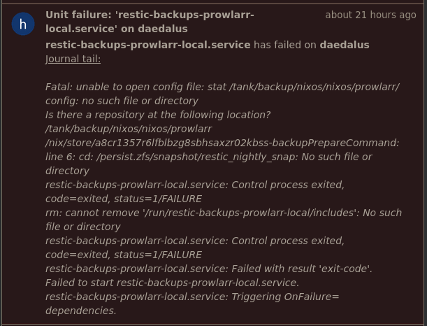
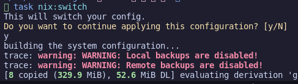

# Backups

Nightly Backups are facilitated by NixOS's module for [restic](https://search.nixos.org/options?channel=23.11&from=0&size=50&sort=relevance&type=packages&query=services.restic.) module and a helper module ive written.

This does a nightly ZFS snapshot, in which apps and other mutable data is restic backed up to both a local folder on my NAS and also to Cloudflare R2 :octicons-info-16:{ title="R2 mainly due to the cheap cost and low egrees fees" }. Backing up from a ZFS snapshot ensures that the restic backup is consistent, as backing up files in use (especially a sqlite database) will cause corruption. Here, all restic jobs are backing up as per the 2.05 snapshot, regardless of when they run that night.

Another benefit of this approach is that it is service agnostic - containers, nixos services, qemu, whatever all have files in the same place on the filesystem (in the persistant folder) so they can all be backed up in the same fashion.

The alternative is to shutdown services during backup (which could be facilitaed with the restic backup pre/post scripts) but ZFS snapshots are a godsend in this area, and im already running them for impermanence.

!!! info "Backing up without snapshots/shutdowns?"

     This is a pattern I see a bit too - if you are backing up files raw without stopping your service beforehand you might want to check to ensure your backups aren't corrupted.

The timeline then is:

| time          | activity                                                                                                                         |
| ------------- | -------------------------------------------------------------------------------------------------------------------------------- |
| 02.00         | ZFS deletes prior snapshot and creates new one, to `rpool/safe/persist@restic_nightly_snap`                                      |
| 02.05 - 04.05 | Restic backs up from new snapshot's hidden read-only mount `.zfs` with random delays per-service - to local and remote locations |

## Automatic Backups

I have added a sops secret for both my local and remote servers in my restic module :simple-github: [/nixos/modules/nixos/services/restic/](https://github.com/truxnell/nix-config/blob/main/nixos/modules/nixos/services/restic/default.nix). This provides the restic password and 'AWS' credentials for the S3-compatible R2 bucket.

Backups are created per-service in each services module. This is largely done with a `lib` helper ive written, which creates both the relevant restic backup local and remote entries in my nixosConfiguration.
:simple-github: [nixos/modules/nixos/lib.nix](https://github.com/truxnell/nix-config/blob/main/nixos/modules/nixos/lib.nix)
!!! question "Why not backup the entire persist in one hit?"

     Possibly a hold over from my k8s days, but its incredibly useful to be able to restore per-service, especially if you just want to move an app around or restore one app.  You can always restore multiple repos with a script/taskfile.

NixOS will create a service + timer for each job - below shows the output for a prowlarr local/remote backup.

```bash
# Confirming snapshot taken overnight - we can see 2AM
truxnell@daedalus ~> systemctl status restic_nightly_snapshot.service
○ restic_nightly_snapshot.service - Nightly ZFS snapshot for Restic
     Loaded: loaded (/etc/systemd/system/restic_nightly_snapshot.service; linked; preset: enabled)
     Active: inactive (dead) since Wed 2024-04-17 02:00:02 AEST; 5h 34min ago
   Duration: 61ms
TriggeredBy: ● restic_nightly_snapshot.timer
    Process: 606080 ExecStart=/nix/store/vd0pr3la91pi0qhmcn7c80rwrn7jkpx9-unit-script-restic_nightly_snapshot-start/bin/restic_nightly_snapshot-start (code=exited, status=0/SUCCESS)
   Main PID: 606080 (code=exited, status=0/SUCCESS)
         IP: 0B in, 0B out
        CPU: 21ms
# confirming local snapshot occured - we can see 05:05AM
truxnell@daedalus ~ [1]> sudo restic-prowlarr-local snapshots
repository 9d9bf357 opened (version 2, compression level auto)
ID        Time                 Host        Tags        Paths
---------------------------------------------------------------------------------------------------------------------
293dad23  2024-04-15 19:24:37  daedalus                /persist/.zfs/snapshot/restic_nightly_snap/containers/prowlarr
24938fe8  2024-04-16 12:42:50  daedalus                /persist/.zfs/snapshot/restic_nightly_snap/containers/prowlarr
442d4de3  2024-04-17 05:05:04  daedalus                /persist/.zfs/snapshot/restic_nightly_snap/containers/prowlarr
---------------------------------------------------------------------------------------------------------------------
3 snapshots

# confirming remote snapshot occured - we can see 4:52AM
truxnell@daedalus ~> sudo restic-prowlarr-remote snapshots
repository 30b7eef0 opened (version 2, compression level auto)
ID        Time                 Host        Tags        Paths
---------------------------------------------------------------------------------------------------------------------
e7d933c4  2024-04-15 22:07:09  daedalus                /persist/.zfs/snapshot/restic_nightly_snap/containers/prowlarr
aa605c6b  2024-04-16 02:39:47  daedalus                /persist/.zfs/snapshot/restic_nightly_snap/containers/prowlarr
68f91a20  2024-04-17 04:52:59  daedalus                /persist/.zfs/snapshot/restic_nightly_snap/containers/prowlarr
---------------------------------------------------------------------------------------------------------------------
3 snapshots
```

NixOS (as of 23.05 IIRC) now provides shims to enable easy access to the restic commands with the correct env vars mounted same as the service.

```bash
truxnell@daedalus ~ [1]> sudo restic-prowlarr-local snapshots
repository 9d9bf357 opened (version 2, compression level auto)
ID        Time                 Host        Tags        Paths
---------------------------------------------------------------------------------------------------------------------
293dad23  2024-04-15 19:24:37  daedalus                /persist/.zfs/snapshot/restic_nightly_snap/containers/prowlarr
24938fe8  2024-04-16 12:42:50  daedalus                /persist/.zfs/snapshot/restic_nightly_snap/containers/prowlarr
---------------------------------------------------------------------------------------------------------------------
2 snapshots
```

## Manually backing up

They are a systemd timer/service so you can query or trigger a manual run with `systemctl start restic-backups-<service>-<destination>` Local and remote work and function exactly the same, querying remote it just a fraction slower to return information.

```bash
truxnell@daedalus ~ > sudo systemctl start restic-backups-prowlarr-local.service
< no output >
truxnell@daedalus ~ [1]> sudo restic-prowlarr-local snapshots
repository 9d9bf357 opened (version 2, compression level auto)
ID        Time                 Host        Tags        Paths
---------------------------------------------------------------------------------------------------------------------
293dad23  2024-04-15 19:24:37  daedalus                /persist/.zfs/snapshot/restic_nightly_snap/containers/prowlarr
24938fe8  2024-04-16 12:42:50  daedalus                /persist/.zfs/snapshot/restic_nightly_snap/containers/prowlarr
---------------------------------------------------------------------------------------------------------------------
2 snapshots
truxnell@daedalus ~> date
Tue Apr 16 12:43:20 AEST 2024
truxnell@daedalus ~>
```

## Restoring a backup

Testing a restore (would do --target / for a real restore)
Would just have to pause service, run restore, then re-start service.

```bash
truxnell@daedalus ~ [1]> sudo restic-lidarr-local restore --target /tmp/lidarr/ latest
repository a2847581 opened (version 2, compression level auto)
[0:00] 100.00%  2 / 2 index files loaded
restoring <Snapshot b96f4b94 of [/persist/nixos/lidarr] at 2024-04-14 04:19:41.533770692 +1000 AEST by root@daedalus> to /tmp/lidarr/
Summary: Restored 52581 files/dirs (11.025 GiB) in 1:37
```

## Failed backup notifications

Failed backup notifications are baked-in due to the global Pushover notification on SystemD unit falure. No config nessecary

Here I tested it by giving the systemd unit file a incorrect path.

<figure markdown="span">

  <figcaption>A deliberately failed backup to test notifications, hopefully I don't see a real one.</figcaption>
</figure>

## Disabled backup warnings

Using [module warnings](https://nlewo.github.io/nixos-manual-sphinx/development/assertions.xml.html), I have also put in warnings into my NixOS modules if I have disabled a warning on a host _that isnt_ a development machine, just in case I do this or mixup flags on hosts. Roll your eyes, I will probably do it.
This will pop up when I do a dry run/deployment - but not abort the build.

<figure markdown="span">



  <figcaption>It is eye catching thankfully</figcaption>
</figure>
