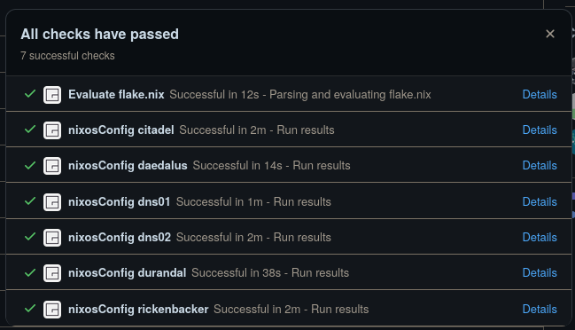

# Software updates

Its crucial to update software regularly - but a homelab isn't a google play store you forget about and let it do its thing. How do you update your software stack regular without breaking things?

## Continuous integration

Continuous integration (CI) is running using :simple-githubactions: [Github Actions](https://github.com/features/actions) and [Garnix](https://Garnix.io). I have enabled branch protection rules to ensure all my devices successfully build before a PR is allowed to be pushed to main. This ensures I have a level of testing/confidence that an update of a device from the main branch will not break anything.

<figure markdown="span">

  <figcaption>Lovely sea of green passed checks</figcaption>
</figure>

## Binary Caching

Binary caching is done for me by [Garnix](https://Garnix.io) which is an amazing tool. I can then add them as [substituter](https://wiki.nixos.org/wiki/Binary_Cache#Binary_cache_hint_in_Flakes). These run each push to _any_ branch and cache the build results for me. Even better, I can hook into them as above for CI purposes.
No code to show here, you add it as an app to your github repo and it 'Just Works :tm:'

```nix
# Substitutions
substituters = [ "https://cache.garnix.io" ];

trusted-public-keys = [
  "nix-community.cachix.org-1:mB9FSh9qf2dCimDSUo8Zy7bkq5CX+/rkCWyvRCYg3Fs="
];

```

<figure markdown="span">

  <figcaption>Lovely sea of green passed checks</figcaption>
</figure>

## Flake updates

Github repo updates are provided by :simple-renovatebot: [Renovate](https://www.mend.io/renovate/) by [Mend](https://mend.io). These are auto-merged on a weekly schedule after passing CI. The settings can be found at :simple-github: [/main/.github/renovate.json5](https://github.com/truxnell/nix-config/blob/main/.github/renovate.json5)

The primary CI is a Garnix build, which Is already building and caching all my systems. Knowing all of the systems have built and cached goes a huge way toward ensuring main is a stable branch.

## Docker container updates

Container updates are provided by :simple-renovatebot: [Renovate](https://www.mend.io/renovate/) by [Mend](https://mend.io). These will either be manually merged after I have checked the upstream projects notes for breaking changes _or_ auto-merged based on settings I have in :simple-github: [/.github/renovate/autoMerge.json5](https://github.com/truxnell/nix-config/blob/dev2/.github/renovate/autoMerge.json5).

!!! info "Semantic Versioning summary"

    Semantic Versioning blurb is a format of MAJOR.MINOR.PATCH:<br>
    MAJOR version when you make incompatible API changes (e.g. 1.7.8 -> 2.0.0)<br>
    MINOR version when you add functionality in a backward compatible manner (e.g. 1.7.8 -> 1.8.0)<br>
    PATCH version when you make backward compatible bug fixes (e.g. 1.7.8 -> 1.7.9)<br>

The auto-merge file allows me to define a pattern of which packages I want to auto-merge based on the upgrade type Renovate is suggesting. As many packages adhere to [Semantic Versioning](https://semver.org/ "A standard for version numbers to indicate type of upgrade"), I can determine how I 'feel' about the project, and decide to auto-merge specific tags. So for example, Sonarr has been reliable for me so I am ok merging all digest, patch and minor updates. I will always review a a major update, as it is likely to contain a breaking change.

!!! warning "Respect pre-1.0.0 software!"
Semantic Versioning also specifies that all software before 1.0.0 may have a breaking change **AT ANY TIME**. Auto update pre 1.0 software at your own risk!

The rational here is twofold. One is obvious - The entire point of doing Nix is reproducibility - what is the point of having flakes and SHA tags to provide the ability

Also, I dont wan't a trillion PR's in my github repo waiting, but I also will not blindly update everything. There is **a balance** between updating for security/patching purposes and avoiding breaking changes. I know its popular to use `:latest` tag and a auto-update service like [watchtower](https://github.com/containrrr/watchtower) - trust me this is a bad idea.

<figure markdown="span">

  <figcaption>I only glanced away from my old homelab for a few months...</figcaption>
</figure>

!!! info "Automatically updating **all versions** of containers will break things eventually!"

    This is simply because projects from time to time will release breaking changes - totally different database schemas, overhaul config, replace entire parts of their software stack etc.  If you let your service update totally automatically without checking for these you will wake up to a completely broken service like I did many, many years ago when Seafile did a major upgrade.

Container updates are provided by a custom regex that matches my format for defining images in my nix modules.

```yaml
    "regexManagers": [
    {
      fileMatch: ["^.*\\.nix$"],
      matchStrings: [
        'image *= *"(?<depName>.*?):(?<currentValue>.*?)(@(?<currentDigest>sha256:[a-f0-9]+))?";',
      ],
      datasourceTemplate: "docker",
    }
  ],

```

And then I can pick and choose what level (if any) I want for container software. The below gives me brackets I can put containers in to enable auto-merge depending on how much I much i trust the container maintainer.

```yaml
  "packageRules": [
    {
      // auto update up to major
      "matchDatasources": ['docker'],
      "automerge": "true",
      "automergeType": "branch",
      "matchUpdateTypes": [ 'minor', 'patch', 'digest'],
      "matchPackageNames": [
        'ghcr.io/onedr0p/sonarr',
        'ghcr.io/onedr0p/readarr',
        'ghcr.io/onedr0p/radarr',
        'ghcr.io/onedr0p/lidarr',
        'ghcr.io/onedr0p/prowlarr'
        'ghcr.io/twin/gatus',
      ]
    },
    // auto update up to minor
    {
      "matchDatasources": ['docker'],
      "automerge": "true",
      "automergeType": "branch",
      "matchUpdateTypes": [ 'patch', 'digest'],
      "matchPackageNames": [
        "ghcr.io/gethomepage/homepage",
      ]

    }
  ]
```

Which results in automated PR's being raised - and **possibly** automatically merged into main if CI passes.

<figure markdown="span">

  <figcaption>Thankyou RenovateBot!</figcaption>
</figure>
