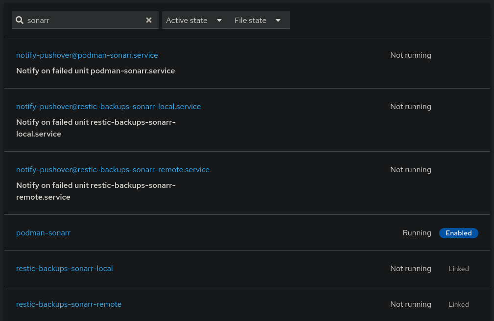

# SystemD pushover notifications

Keeping with the goal of simple, I put together a `curl` script that can send me a pushover alert. I originally tied this to individual backups, until I realised how powerful it would be to just have it tied to every SystemD service globally.

This way, I would never need to worry or consider _what_ services are being created/destroyed and repeating myself _ad nauseam_.

!!! question "Why not Prometheus?"

    I ran Prometheus/AlertManager for many years and well it can be easy to get TOO many notifications depending on your alerts, or to have issues with the big complex beast it is itself, or have alerts that trigger/reset/trigger (i.e. HDD temps).
    This gives me native, simple notifications I can rely on using basic tools - one of my design principles.

Immediately I picked up with little effort:

- Pod ~~crashloop~~ failed after too many quick restarts
- Native service failure
- Backup failures
- AutoUpdate failure
- etc

<figure markdown="span">

  <figcaption>NixOS SystemD built-in notifications for all occasions</figcaption>
</figure>

## Adding to all services

This is accomplished in :simple-github:[/nixos/modules/nixos/system/pushover](https://github.com/truxnell/nix-config/blob/main/nixos/modules/nixos/system/pushover/default.nix), with a systemd service `notify-pushover@`.

This can then be called by other services, which I setup with adding into my options:

```nix
  options.systemd.services = mkOption {
    type = with types; attrsOf (
      submodule {
        config.onFailure = [ "notify-pushover@%n.service" ];
      }
    );
```

This adds into every systemd NixOS generates the "notify-pushover@%n.service", where the [systemd specifiers](https://www.freedesktop.org/software/systemd/man/latest/systemd.unit.html#Specifiers") are injected with `scriptArgs`, and the simple bash script can refer to them as `$1` etc.

```nix
systemd.services."notify-pushover@" = {
      enable = true;
      onFailure = lib.mkForce [ ]; # cant refer to itself on failure (1)
      description = "Notify on failed unit %i";
      serviceConfig = {
        Type = "oneshot";
        # User = config.users.users.truxnell.name;
        EnvironmentFile = config.sops.secrets."services/pushover/env".path; # (2)
      };

      # Script calls pushover with some deets.
      # Here im using the systemd specifier %i passed into the script,
      # which I can reference with bash $1.
      scriptArgs = "%i %H"; # (3)
      # (4)
      script = ''
        ${pkgs.curl}/bin/curl --fail -s -o /dev/null \
          --form-string "token=$PUSHOVER_API_KEY" \
          --form-string "user=$PUSHOVER_USER_KEY" \
          --form-string "priority=1" \
          --form-string "html=1" \
          --form-string "timestamp=$(date +%s)" \
          --form-string "url=https://$2:9090/system/services#/$1" \
          --form-string "url_title=View in Cockpit" \
          --form-string "title=Unit failure: '$1' on $2" \
          --form-string "message=<b>$1</b> has failed on <b>$2</b><br><u>Journal tail:</u><br><br><i>$(journalctl -u $1 -n 10 -o cat)</i>" \
          https://api.pushover.net/1/messages.json 2&>1
      '';
```

1.  Force exclude this service from having the default 'onFailure' added
2.  Bring in pushover API/User ENV vars for script
3.  Pass SystemD specifiers into script
4.  Er.. script. Nix pops it into a shell script and refers to it in the unit.

!!! bug

    I put in a nice link direct to Cockpit for the specific machine/service in question that doesnt _quite_ work yet... (:octicons-issue-opened-16: [#96](https://github.com/truxnell/nix-config/issues/96))

## Excluding from a services

Now we may not want this on ALL services. Especially the pushover-notify service itself. We can exclude this from a service using Nix `nixpkgs.lib.mkForce`

```nix
# Over-write the default pushover
systemd.services."service".onFailure = lib.mkForce [ ] option.
```
