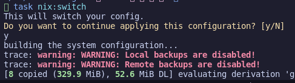

I've added warnings and assertations to code using nix to help me avoid misconfigurations. For example, if a module needs a database enabled, it can abort a deployment if it is not enabled. Similary, I have added warnings if I have disabled backups for production machines.

!!! question "But why, when its not being shared with others?"

Because I guarentee ill somehow stuff it up down the track and accidently disable things I didnt mean to. Roll your eyes, Ill thank myself later.

> Learnt from: [Nix Manual](https://nlewo.github.io/nixos-manual-sphinx/development/assertions.xml.html)

## Warnings

Warnings will print a warning message duyring a nix build or deployment, but **NOT** stop the action. Great for things like reminders on disabled features

To add a warning inside a module:

```nix
    # Warn if backups are disable and machine isn't a dev box
    config.warnings = [
      (mkIf (!cfg.local.enable && config.mySystem.purpose != "Development")
        "WARNING: Local backups are disabled!")
      (mkIf (!cfg.remote.enable && config.mySystem.purpose != "Development")
        "WARNING: Remote backups are disabled!")
    ];

```

<figure markdown="span">

  <figcaption>Oh THATS what I forgot to re-enable...</figcaption>
</figure>

## Abort/assert

Warnings bigger and meaner brother. Stops a nix build/deploy dead in its tracks. Only useful for when deployment is incompatiable with running - i.e. a dependency not met in options.
