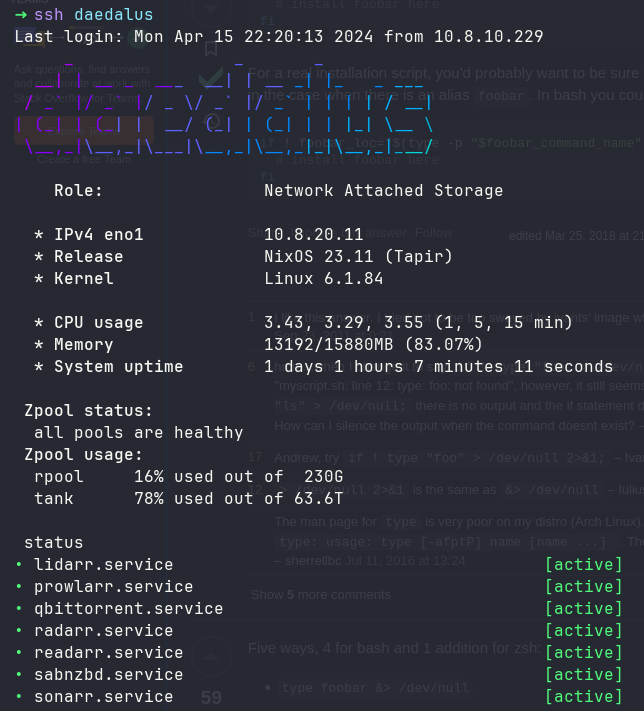

# Message of the day

Why not include a nice message of the day for each server I log into?

The below gives some insight into what the servers runing, status of zpools, usage, etc.
This is also nice in that if there IS a zpool error, it will print the output in the MOTD with is very eye-catching...



Code TLDR

[/nixos/modules/nixos/system/motd/default.nix](https://github.com/truxnell/nix-config/blob/462144babe7e7b2a49a985afe87c4b2f1fa8c3f9/nixos/modules/nixos/system/motd/default.nix#L3])

```nix
let
  motd = pkgs.writeShellScriptBin "motd"
    ''
      #! /usr/bin/env bash
      source /etc/os-release
      service_status=$(systemctl list-units | grep podman-)

      ...
      printf "$BOLDService status$ENDCOLOR\n"
    '';
in
```

This gets us a shells script we can then directly call into systemPackages - and after that its just a short hop to make this part of the shell init.

!!! note
Replace with your prefered shell!

```nix
environment.systemPackages = [
    motd
];
programs.fish.interactiveShellInit =  ''
    motd
'';
```
