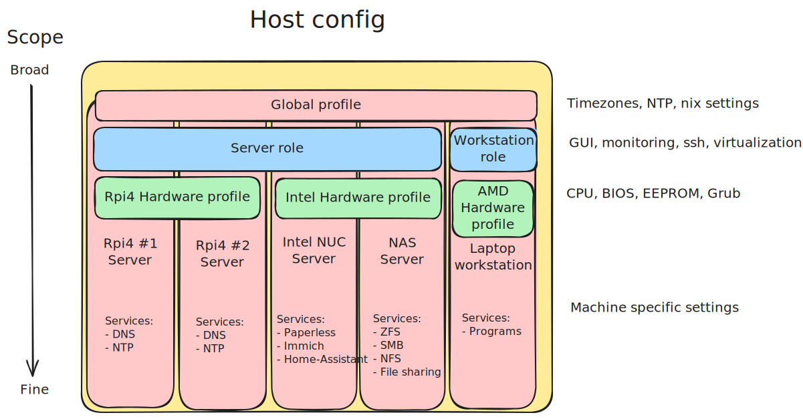

# Design principles

Taking some lead from the [Zen of Python](https://peps.python.org/pep-0020/):

- Minimise dependencies, where required, explicitly define dependencies
- Use plain Nix & bash to solve problems over additional tooling
- Stable channel for stable machines. Unstable only where features are important.
- Modules for a specific service - Profiles for broad configuration of state.
- Write readable code - descriptive variable names and modules
- Keep functions/dependencies within the relevant module where possible
- Errors should never pass silently - use assert etc for misconfigurations
- Flat is better than nested - use built-in functions like map, filter, and fold to operate on lists or sets

# Logic

Do I have logic in all this mess?  Sort of?

## Module use

I have taken the following approach to using modules for different goals:

<figure markdown="span">

  <figcaption>Daring logic for using profiles and modules</figcaption>
</figure>

**Profiles** to incrementally build up a hosts shape in layers.  These are 'wide' and touch a broad number of settings to acheive a certain goal:
They can be broken down into:
- Global profiles - Settings every single machine I'll ever roll will use.  *(ex. Timezone, secret config, basic nix settings)*.
- Hardware profile - Settings for a specific hardware platform.  Taps into the nixos-hardware modules and defines my own.  Useful to ensure all my raspi4's have the same hardware setup etc. *(ex. grub setup, eeprom updates, kernel modules)*
- Role profiles - General use of host.  Allows all 'servers' to have the same settings, workstations, development environemtns etc.  *(ex. monitoring, log rotation, gui)*
- Host profiles - Currently left in each hosts file in the hosts folder.  These are machine specific settings that are unique to that host. *(ex. boot disks, services to run on machine, hostname)

**Modules** to define a specific service or setting.  These are a lot tighter in scope and only do what is required to setup one particular thing - however they do still touch a few areas as each module may setup reverse proxy, backups, impermanence, etc - but only exactly what the service needs.

This aproach does help massively with [DRY](https://en.wikipedia.org/wiki/Don%27t_repeat_yourself).